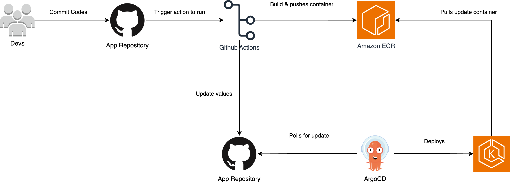
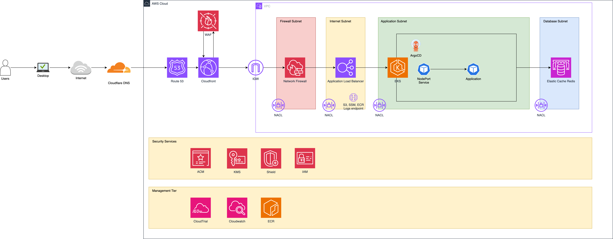
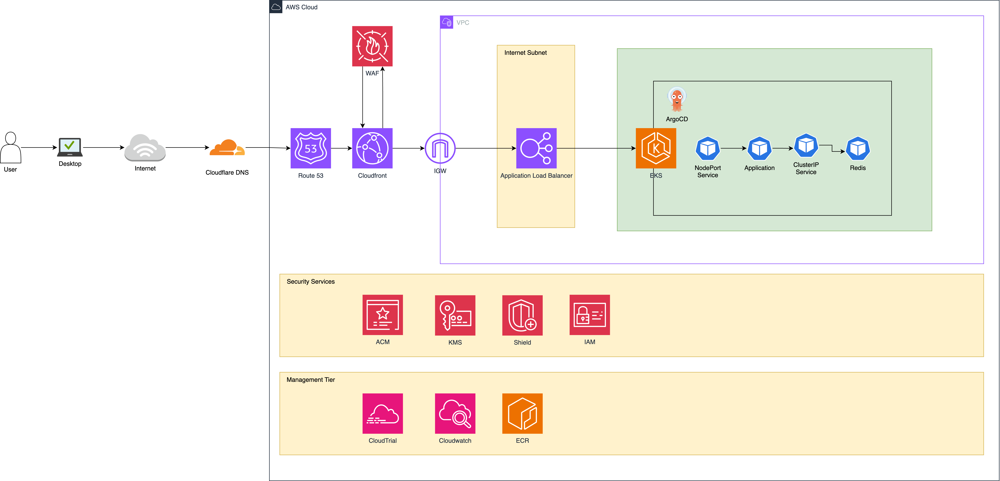

# GovTech Devops Homework

## **TASK**

Your objective is to provide the following deliverables within one week, utilizing specified technologies. Ensure meticulous tracking of your progress by committing frequently and maintaining a detailed log of encountered problems and their resolutions.

### [Source code in Github](https://github.com/OliverTeo288/govtech-devops-homework)

It is currently a private repo as it is part of the requirements, do let me know if access is required and I will add your github users inside

### [Domain of completed exercise](https://hw.bigduck.cloud)

### **CD Pipeline Plan**


**Choice of Tools:** Github, ArgoCD, ECR, EKS

**Reasons:** 

Main benefits of using these tools, by using ArgoCD with GitHub. ArgoCD automates the CD process, ensuring that every time a new commit is pushed to the Git repository, it is automatically deployed to the Kubernetes cluster by continuously polling the Git repo and synchronizing the changes with the latest commit. Additionally, rolling back to a previous version is straightforward with ArgoCD by reverting to a known state directly from the Git history.

ArgoCD provides a comprehensive dashboard that offers a visual representation of the deployed applications, their current state, and synchronization status. This enhances visibility, making it easier to monitor and manage deployments.

Hence, this is the reason why I choose to combine these tools to ease my deployment into a Kubernetes environment.

### **Cloud Architecture**


#### Ideal Architecture


In this project, I have used my own domain and created a hosted zone in Route 53 to manage the domain hw.bigduck.cloud. This setup allows me to enhance availability by failing over to another region if required, which also necessitates spinning up another architecture in either ap-southeast-2 or ap-southeast-3.

Subsequently, I have chosen to use CloudFront in front of my ALB to ensure the speed of the application and enforce security response headers to be sent back to the client, as ALB doesn’t allow customization of response headers. By using CloudFront with WAF in front, I can also block bot requests and unwanted IP addresses before they even enter my VPC, which helps save costs as well.

To ensure security, I have implemented the following measures:

1. Network Firewall for Level 4 egress traffic, enforcing TLS versions and TLS fingerprinting.
2. WAF to block bot requests and suspicious IP addresses.
3. CloudFront geo-restriction to only allow SG traffic.
4. NACL to control traffic within the subnets.
5. Basic Shield to prevent DDOS attacks.

For this architecture, EKS is used as my primary compute resource, running the application as a deployment within the cluster and serving traffic through an Application Load Balancer, using elasticcache redis as the database

To ensure availability, I have designed this architecture to utilize at least two Availability Zones (AZs). Each AZ has its own NAT Gateway and Network Firewall Endpoint.


#### Deployed Architecture


However, to save costs, the current deployed architecture for this exercise involves spinning up a pod for Redis instead of using ElastiCache, and removing NACL and the Network Firewall (~$400-$500 per month).


### **Future planning**

1. Monitoring/Alerting for the whole infrastructure
2. SIEM to be implemented for logs
3. Cluster Autoscaler or Karpenter
 

### **Issues faced**

#### ArgoCD

This is my first time using ArgoCD. Due to my initial approach of managing all my Kubernetes deployments and services using Terraform, ArgoCD was unable to update the images within the Kubernetes cluster as it detected no changes within the manifests. 

**Resolution:**

Therefore, I had to remove Terraform from controlling the Kubernetes deployments and add a manifest folder inside the application code. The GitHub Actions scripts now update the new image with the commit SHA as the image tag and update the deployment manifest with the new image tag. This allows ArgoCD to continuously poll and update the Kubernetes deployment with the new image.

#### Certificate verification within one Terraform apply

Upon creating a hosted zone within Route 53, I wanted to loop through the newly created hosted zone and output the list of nameservers to be added to my CloudFront DNS records. However, I was unable to use a loop as the resources hadn't been created yet, and I couldn't use the `depends_on` tag for Terraform `for_each`.

**Resolution:**

Since the hosted zone needs to be created first, my immediate solution was to write a simple shell script to first apply Terraform, targeting the hosted zone creation. Subsequently, I applied Terraform to the whole infrastructure.

```
terraform init && terraform fmt --recursive && terraform apply -target module.domain.aws_route53_zone.main -var-file config.tfvars --auto-approve && terraform apply -var-file config.tfvars --auto-approve
```